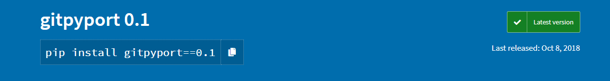
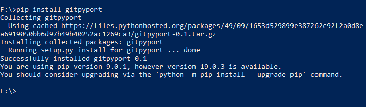
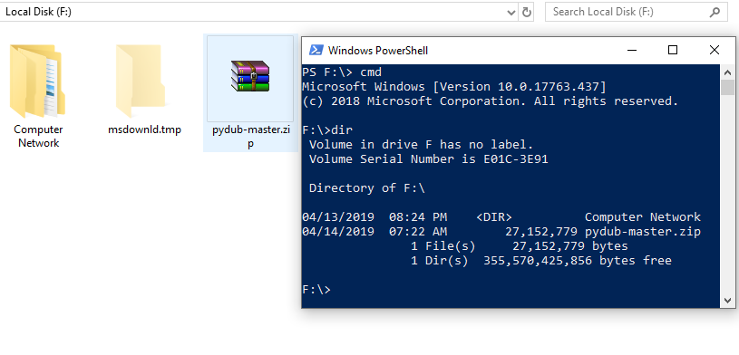
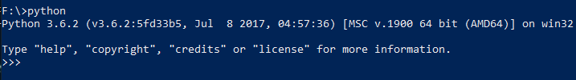
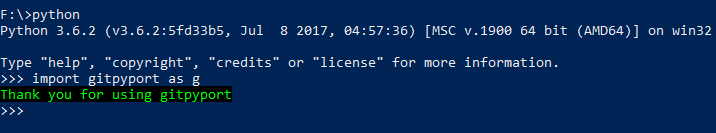
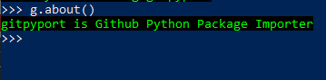
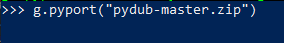
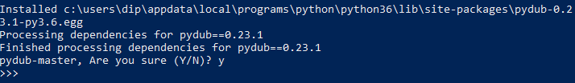
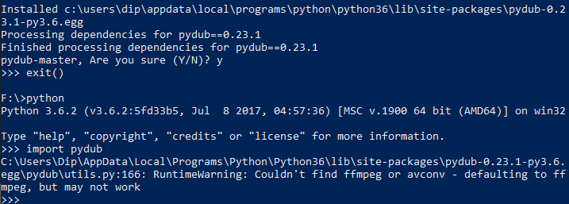

# Github Python Importer

This module will help to import github python packages as python module.

## Getting Started

PyPi Repository [Link](https://pypi.org/project/gitpyport/)



### Prerequisties

Python 3.6 (Tested Platform Python Version)

### Installation and Usage

**Installing via PyPI**

`pip install gitpyport`



**Here in the example the pydub module is installed without using pip**

1. Open Python Terminal in the path where your github downloaded package placed.
2. Go to the path in cmd



3. Type python to enter into python terminal



4. Now type `import gitpyport as g`
If the module is correctly installed then it will return a message



`g.about()` will return what the package is.



To import the github package as python module type the following command

`g.pyport("file_path")`
Here the file_path = "pydub-master.zip"



Now after pressing enter the package will be installed as a module without any need of user interaction. 



To use the module firstly exit from the present python terminal by entering the following command

`exit()`

Then again enter into python terminal and import the new python module. The module should be imported without need of any other dependency.



*Example Snippet*

```python
import gitpyport as g
g.about()
g.pyport("file_path")
exit()
```
